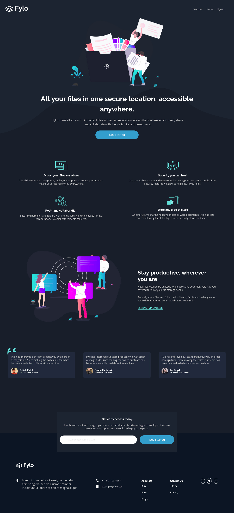
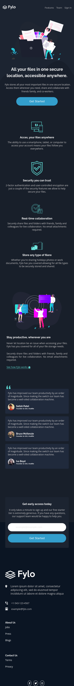

# **Fylo dark theme landing page - Frontend Mentor**

## Hello there 👋!! Thanks for cheaking out this project.

This project is a solution for **Frontend Mentor challenge**. Primary goal of this project is to build a landing page that looks as close as possible to the given design. I hope to improve and sharpen my web layout skill by building this realistic project.

# **1. Table of contents 📝**

- ## [Fylo dark theme landing page](#fylo)
  - [1. Table of content](#table-of-content) 📝
  - [2. Overview](#overview) 🎯
    - [The challanges](#the-challenges)
    - [How to run the projects](#how-to-run-the-projects)
    - [Links](#links)
  - [3. Screenshots](#screenshots) 📷
  - [4. My process](#my-process) ✨
    - [Built with](#built-with)
    - [What I learned](#what-i-learned)
    - [Useful resources](#useful-resources)
  - [5. Author](#author) 🙋🏻

# **2. Overview 🎯**

## The challanges

users should be able to:

- View the optimal layout for the site depending on their device's screen size
- See hover states for all interactive elements on the page

Check out the details of the challange in the [Frontend Mentor Page.](https://www.frontendmentor.io/challenges/fylo-dark-theme-landing-page-5ca5f2d21e82137ec91a50fd)

## How to run the projects

Open the code editor and make sure that you have **live preview** extetion downloaded in the editor. Simply, open the HTML file and right click the mouse and click to **open with live server** or you can press `ctrl+l+o` to run the project.

## Links

Website URL: <https://fylo-dark-themeee.netlify.app/>

Solution URL: Coming soon

# **3. Screenshots 📷**

## Desktop View

## Mobile View

# **4. My process ✨**

## Built With

- Semantic HTML5 markup
- CSS3 custom properties
- Flexbox
- CSS Grid
- Responsive design with mobile-first workflow

## What I learned

- Learned how to use flexbox and css grid in a better way and when to use which one.

- Got a good practice with website layout with a realistic design.

- Importance of mobile-first design approach

## Useful resources

- checkout [CSS TRICKS](https://css-tricks.com/snippets/css/a-guide-to-flexbox/) page to get a deep understanding about how flexbox work.

- You can check out [Traversy Media](https://www.youtube.com/watch?v=0xMQfnTU6oo&t=79s) for understanding CSS Grid.

# **4. Author 🙋🏻**

- Linkedin : [sagorroy](https://www.linkedin.com/in/sagorroy/)

- Gmail : <sagorroy.ms@gmail.com>

Thank you for your time 🙂 🙂
